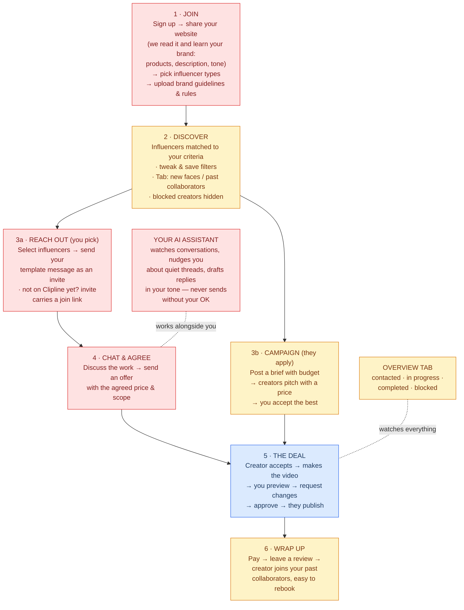

# Clipline Brand Journey

**The ideal brand experience, defined by the product owner — compared against what the codebase implements today.**
Date: 2026-08-21 · Scope: brand journey only · Companion docs: [product spec](superpowers/specs/2026-08-16-video-micro-influencer-marketplace-design.md), [PRODUCT.md](../PRODUCT.md)

---

## The journey at a glance

Blue boxes exist today. Amber boxes are partially built. Red boxes don't exist yet.

The one fully solid piece is **box 5** — the deal itself. Once a deal exists, the make → preview → revise → approve → publish loop is robust and hard to cheat. Almost everything *before* a deal exists is where the gaps are.

---

## The ideal journey — Brand "A" walkthrough

### 1. Join

Brand A signs up and lands in a short onboarding:

- **Website** — A enters their URL. The platform reads the site and extracts a **product catalog (SKUs)**, a **brand description**, and a broader **understanding of the brand** (tone, positioning, categories). A reviews and edits everything before it's saved — nothing auto-publishes. This profile then powers discover matching, campaign briefs, reachout templates, and the AI assistant's context.
- **Influencer preferences** — what kind of creators should Clipline suggest? Picked from a respectful, content-based taxonomy (see below) with sensible defaults pre-selected from the website understanding.
- **Documents** — upload brand guidelines and the brand's standing **rules for influencers**, applied automatically to every creator who works with A.
- **Anything else** — free text.

**Proposed taxonomy** (categorizes *content*, never the creator as a person):

| Dimension | Values |
|---|---|
| Content niche | Beauty & skincare · Fashion · Fitness & wellness · Food & cooking · Tech & gadgets · Gaming · Travel · Finance · Parenting & family · Education & how-to · Home & DIY · Lifestyle & vlogs · Music · Sports & outdoors · Pets · Art & design |
| Format | Short-form video (Reels/Shorts/TikTok) · Long-form YouTube · UGC ads · Reviews & unboxings · Tutorials · Livestreams |
| Audience size | Nano (1K–10K) · Micro (10K–100K) · Mid (100K–500K) |
| Language / region | From the existing creator profile fields |

> To reconcile with the existing creator-side `niches` field so brand preferences and creator profiles speak the same vocabulary.

### 2. Discover

Results open pre-filtered to A's onboarding criteria. A can change filters freely and **save filter sets** for reuse. Two tabs: **new faces** (creators A has never worked with — the default) and **past collaborators**. Creators on A's blocklist never appear.

### 3. Two ways to engage

- **Reach out (outbound)** — A multi-selects creators in discover and sends their **template message** (managed in the brand area) as an invitation. The creator accepts (a chat opens) or declines. One pending invite per brand–creator pair; no follow-up messages until accepted — spam-proof by design.
  - **Off-platform influencers**: A can also invite a creator who isn't on Clipline yet. The platform appends its own generated text with a unique join link to A's message — sent by email when an address is known, otherwise A copies the composed message into their own social DMs. When the creator signs up through the link, the conversation with A opens automatically. Every reachout doubles as creator acquisition.
- **Campaign (inbound)** — A posts a brief with a budget; creators apply with a pitch and a proposed price; A accepts the best. *(Exists today, but accepting currently leads nowhere — see Gap 5.)*

### 4. Chat & agree

Inside the thread, A and the creator discuss the work. *(Recommended, open to override:)* A sends an **offer** — based on one of the creator's offerings but with adjustable price and scope. The creator accepts, and the deal starts at the agreed price.

### 5. The deal

The existing loop: creator accepts → produces the video → A previews → bounded revision rounds → A approves → creator publishes → A verifies the live link.

### 6. Wrap up

Payment settles (eventually held in escrow — see appendix), A leaves a review, and the creator moves to the past-collaborators tab for easy rebooking.

### Always on

- **Overview tab** — one glance at everything: who's been contacted (invite pending / accepted / declined), arrangements in progress, completed, and who's blocked.
- **AI assistant** — watches A's own threads, flags conversations going quiet, drafts replies and reminders in A's voice. **Draft-only: nothing is ever sent without A's explicit confirmation.** Delivered in-app and as email digests.

---

## Stage by stage: ideal vs implemented

| Stage | Status | What exists today |
|---|---|---|
| Brand onboarding + website ingestion | ❌ Absent | Signup sends brands straight to `/discover` (`app/(auth)/actions.ts`). The `brand_profiles` table exists but **no UI ever writes it** — it's only ever read (`app/campaigns/[id]/page.tsx:57`, `app/campaigns/page.tsx:209`), so company/website render as null forever. No file upload anywhere; Supabase Storage is unused. No crawling/extraction of any kind. |
| Influencer taxonomy | 🟡 Partial | Creator-side `niches`, country, languages exist on `creator_profiles` and as discover filters (`lib/discovery/filters.ts`). No brand-side preference storage, no audience-size tiers, no format taxonomy beyond offering type. |
| Discover | 🟡 Partial | `/discover` has search, niche, country, format, and price filters with pagination (`lib/discovery/queries.ts`) — solid base. No personalization from brand preferences, no saved filters, no collaborated/new split (derivable from `deals` but not built), no blocklist concept anywhere in the schema. |
| Reachout / pre-deal chat | ❌ Absent | Messaging is strictly deal-scoped — `messages.deal_id` is NOT NULL (`supabase/migrations/0003_deals.sql:142`) and RLS only admits deal participants. No conversations without a deal, no multi-select in discover, no message templates, no invites of any kind. |
| Campaigns (inbound) | 🟡 Partial, dead-end | Brands post campaigns and creators apply with pitch + proposed price (`app/campaigns/`). But `decideApplication` (`app/campaigns/[id]/actions.ts:62`) only flips a status column: **no deal is created and the proposed price is silently discarded** — the UI tells the brand to "book them from their storefront" at the listed price instead. |
| Chat → deal / negotiation | ❌ Absent | The only booking path is `/book/[offeringId]` at the listed price, frozen server-side. No offers, no counter-offers, no price adjustment anywhere. |
| The deal loop | ✅ Built, strongest part | State machine in `lib/deals/machine.ts` (32 transitions) mirrored into the `deal_transitions` table; every mutation goes through the `transition_deal()` RPC — the `deals` table has no UPDATE grant, so the flow can't be bypassed. Anti-ghosting timers on pg_cron (72h accept expiry, 5-day auto-approve). Preview → capped revisions → publish with live-URL verification. |
| Overview | 🟡 Partial | `/deals` groups deals into needs-you / in-flight / done. Covers arrangements only — no contacted status (nothing to contact with), no blocklist. |
| Wrap up | 🟡 Partial | Reviews work (`app/deals/[id]/review-actions.ts`). Payment is off-platform only: `payment_mode: "off_platform"` is hardcoded at booking (`app/book/[offeringId]/actions.ts:46`); the escrow branch is fully modeled in the state machine but unreachable (see appendix). |
| AI assistant | ❌ Absent | No AI/LLM code and no notification system at all — not even the transactional email the spec promised. The only automation is the deal-timer cron, which acts on deals, not conversations. |

---

## The gaps, ranked

### Gap 1 — Brand onboarding + website ingestion `P0 · unlocks everything else`

A short wizard mirroring the existing creator wizard pattern (`app/onboarding/`, progress derived from data as in `lib/onboarding/steps.ts`):

1. **Website step** — brand enters URL → async ingestion ("we're reading your site…") crawls the homepage and key pages → LLM extraction proposes a description, product/SKU list, and tone/positioning/categories → **brand confirms or edits every field before saving**. Manual entry is always available as the fallback for unreachable or JS-heavy sites.
2. **Preferences step** — taxonomy selections, pre-checked from the website understanding.
3. **Documents step** — brand guidelines + rules-for-influencers to Supabase Storage.
4. **Free text.**

Data: write `brand_profiles` (finally), plus new `brand_preferences`, `brand_products` (SKUs), and stored documents.

> **Safety note:** scraped website content is untrusted input, exactly like creator messages are for the assistant (Gap 7). The extractor's output is only ever a *structured proposal* the brand approves — it is never executed, never auto-published, and never fed to anything with the power to act.

### Gap 2 — Personalized discover, saved filters, collaborators tab `P1`

Default the filter state from `brand_preferences`. Add a `saved_filters` table (brand, name, params). The new-faces/past-collaborators split is a query over existing `deals` data — no new schema. Exclude the brand's blocklist (Gap 4) from results and reachout.

### Gap 3 — Reachout + invite-then-chat messaging `P0`

The biggest structural addition: conversations that exist **before** a deal.

- New `conversations` table (brand, creator, status: invited / accepted / declined, unique per pair) and let `messages` attach to a conversation as well as a deal.
- `message_templates` per brand, managed in the brand area.
- Multi-select in discover fans out one invitation each. Creators get an inbox to accept or decline. Anti-spam is structural: one pending invite per pair, no messages until accepted.
- **Off-platform variant:** an `invites` table (brand, external handle/email, unique claim token, status). The platform composes brand template + its own invite text with the claim link — emailed when an address is given, otherwise copy-paste for the brand's own DMs (social platforms don't allow third-party sending). Signup via the link auto-opens the accepted conversation with the inviting brand.
- **Chat → deal (recommendation):** an "offer" message type — offering-based, adjustable price/scope. Creator acceptance creates the deal through the existing `transition_deal` machinery with the agreed price snapshotted, the same shape as the campaign fix below.

### Gap 4 — Overview tab `P1`

Mostly a read view once Gaps 2–3 exist: aggregate deals + conversations + a new `blocklist` table (brand, creator). Sections: contacted (pending / accepted / declined), in progress, completed, blocked.

### Gap 5 — Campaign accept dead-end `P1 · a bug fix as much as a feature`

`decideApplication` must create the deal + brief on accept, snapshotting the application's `proposed_price_cents` instead of discarding it. Campaigns then stand as the inbound mirror of reachout — creators come to the brand, with their own price honored.

### Gap 6 — Notifications & email `P1 · prerequisite for Gap 7`

An in-app notification center plus transactional email: invite delivery, deal events, and later the assistant's digests. This also closes a platform-wide hole — today a brand learns nothing unless they happen to reload the site.

### Gap 7 — The brand AI assistant `P2 · build last`

Runs over the brand's own threads only. Flags stale conversations, drafts replies and reminders in the brand's learned voice, delivers via Gap 6's channels.

**Prompt-injection safeguards (non-negotiable, enforced by architecture, not by the model):**

- Creator-authored content is **data, never instructions** — delimited and quoted, never placed in the system prompt.
- The assistant **has no send capability**. Its only output is a draft; the send action is a separate server-side endpoint that requires the brand's explicit UI confirmation.
- Context is allow-listed to the brand's own threads and profile — nothing else is reachable.
- No tool-calling loops driven by message content; the assistant reads, summarizes, and proposes.
- The confirm-before-send rule lives in the server, so even a fully compromised model output can't skip it.

### Build order

Gaps depend on each other; the sequence that avoids rework:

**1 Onboarding → 3 Conversations/reachout → 2 Discover upgrades → 5 Campaign fix → 4 Overview → 6 Notifications → 7 Assistant**

---

## What's already ideal

Credit where due — the foundation the new work plugs into is genuinely strong:

- **The deal state machine** is the best part of the codebase: single source of truth in code, generated into SQL, mutation only through one RPC, no way to bypass it — with real anti-ghosting timers.
- **Server-side price freezing** at booking (a DB trigger, not app code) means agreed terms can't be tampered with. The offer flow in Gap 3 should reuse exactly this mechanism.
- **Defense in depth**: RLS on every table, per-page role gates re-asserted inside every server action.
- **Reviews and admin** (disputes, reports, suspension) already work.

## Appendix — other gaps observed (outside this flow)

- **Payments are stubbed.** Booking hardcodes off-platform payment; the `payments`/`payouts`/`stripe_events` tables and the escrow state-machine branch are fully built but unreachable — no Stripe dependency or webhook exists. The seam is clean: escrow needs a booking-time branch plus a webhook that calls `transition_deal(id, 'fund', 'system')`.
- **No password reset** — the login page has no "forgot password" path.
- **Verified-stats badge is unreachable** — social stats come from public scraping; the OAuth verification path (spec phase 5) never shipped, so `verification_status = 'verified'` can never occur.
- **Dead code**: `app/auth/callback/route.ts` (nothing produces an auth code) and a hardcoded `/c/mayafilms` demo link on the landing page.
